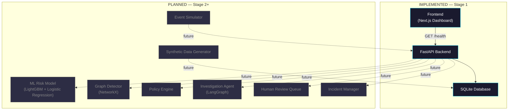
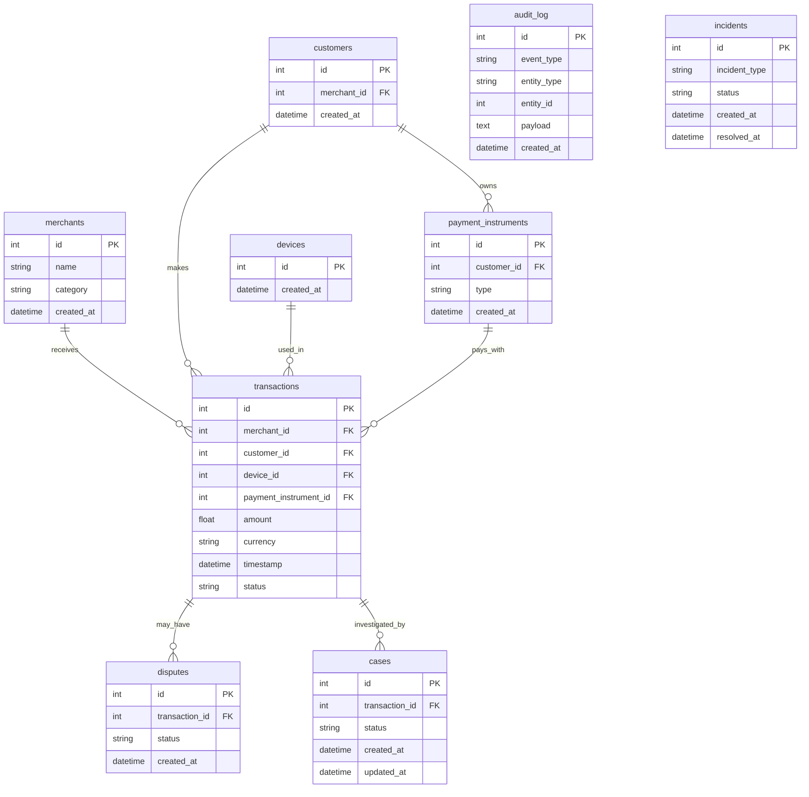

# SentinelRisk — Architecture

> Defense-only Payment Risk Intelligence

## Overview

SentinelRisk is a modular, defense-only payment risk intelligence system designed to detect suspicious transactions, investigate coordinated abuse, and support safe, auditable risk decisions.

The architecture is designed in **layers**, each built in a separate stage. This document tracks what is **implemented** versus **planned**.

---

## System Architecture



---

## Component Status

| Component | Status | Stage | Description |
|-----------|--------|-------|-------------|
| FastAPI Backend | ✅ IMPLEMENTED | 1 | API server with health endpoint and placeholder routes |
| SQLite Database | ✅ IMPLEMENTED | 1 | 9 foundation tables with proper schema |
| Next.js Frontend | ✅ IMPLEMENTED | 1 | Dashboard shell with navigation and backend health indicator |
| Test Suite | ✅ IMPLEMENTED | 1 | Unit, database, and integration tests |
| ML Risk Model | ❌ PLANNED | 2 | LightGBM + Logistic Regression fraud scoring |
| Synthetic Data | ❌ PLANNED | 2 | Realistic transaction and fraud data generation |
| Graph Detector | ❌ PLANNED | 3 | NetworkX-based coordinated abuse detection |
| Policy Engine | ❌ PLANNED | 3 | Rule-based decision engine |
| Investigation Agent | ❌ PLANNED | 4 | LangGraph autonomous investigation |
| Human Review Queue | ❌ PLANNED | 4 | Manual review workflow for analysts |
| Incident Manager | ❌ PLANNED | 5 | System incident detection and response |
| Event Simulator | ❌ PLANNED | 5 | Real-time transaction event simulation |

---

## Backend Architecture

### FastAPI Application

```
backend/app/
├── main.py          # Application factory, CORS, lifespan, router registration
├── config.py        # Pydantic settings from .env
├── api/
│   ├── health.py    # GET / and GET /health
│   └── placeholders.py  # Future endpoint stubs (/events, /risk, /cases, etc.)
├── db/
│   ├── database.py  # SQLAlchemy engine, session, init_database()
│   └── models.py    # 9 ORM models
├── policy/          # Future: policy engine
├── scoring/         # Future: risk scoring
├── graph/           # Future: graph detection
└── incidents/       # Future: incident management
```

### API Endpoints

| Endpoint | Method | Status | Purpose |
|----------|--------|--------|---------|
| `/` | GET | ✅ Live | Service info |
| `/health` | GET | ✅ Live | Health check for frontend |
| `/events/` | GET | 🔲 Stub | Transaction events (Stage 2+) |
| `/risk/` | GET | 🔲 Stub | Risk assessments (Stage 2+) |
| `/cases/` | GET | 🔲 Stub | Investigation cases (Stage 3+) |
| `/metrics/` | GET | 🔲 Stub | System metrics (Stage 3+) |
| `/incidents/` | GET | 🔲 Stub | Incident management (Stage 5+) |
| `/model/` | GET | 🔲 Stub | Model management (Stage 2+) |

---

## Database Schema



---

## Frontend Architecture

### Dashboard Shell

The frontend is a Next.js application with App Router providing:

- **Sidebar navigation** with links to all future screens
- **Backend health indicator** polling `GET /health`
- **Empty state pages** for each future module
- **Professional dark theme** appropriate for risk operations

### Pages

| Route | Purpose | Status |
|-------|---------|--------|
| `/` | Risk Overview | 🔲 Empty state |
| `/live-feed` | Live Risk Feed | 🔲 Empty state |
| `/investigation` | Investigation | 🔲 Empty state |
| `/review-queue` | Review Queue | 🔲 Empty state |
| `/incidents` | Incidents | 🔲 Empty state |
| `/model-evaluation` | Model Evaluation | 🔲 Empty state |

---

## Future Architecture (Planned)

### ML Layer (Stage 2)

- Feature engineering pipeline extracting transaction features
- LightGBM for high-throughput scoring
- Logistic Regression as interpretable baseline
- Calibrated probability outputs for risk scoring

### Graph Layer (Stage 3)

- NetworkX-based graph construction from shared entities
- Community detection for coordinated fraud rings
- Shared device, IP, and payment instrument analysis

### Policy Layer (Stage 3)

- Rule-based decision engine
- Configurable thresholds and actions
- Audit trail for all policy decisions

### Agent Layer (Stage 4)

- LangGraph-based investigation agent
- Autonomous evidence gathering and analysis
- Structured investigation reports

### Human Review (Stage 4)

- Analyst review queue for flagged transactions
- Decision tracking with audit logs
- Escalation workflows

### Incident Management (Stage 5)

- System health monitoring
- Anomaly spike detection
- Incident response procedures (including 2AM scenarios)

---

## Design Decisions

### Why SQLite?

SQLite provides zero-configuration, file-based storage ideal for development and demonstration. The SQLAlchemy ORM layer allows swapping to PostgreSQL by changing only the `DATABASE_URL` environment variable.

### Why FastAPI?

- Async-native Python framework
- Automatic OpenAPI documentation
- Pydantic-based request/response validation
- Easy to test with `TestClient`

### Why modular packages?

Each backend package (`policy/`, `scoring/`, `graph/`, `incidents/`) maps to a future architectural layer. This separation ensures:
- Clear ownership boundaries
- Independent development and testing
- No circular dependencies between layers

### Why separate audit_log table?

Audit logs serve a fundamentally different purpose than transaction data:
- Append-only (never updated or deleted)
- Cross-entity (logs events for transactions, cases, incidents, etc.)
- Compliance-critical (must be independently queryable)
- Different access patterns than operational tables
