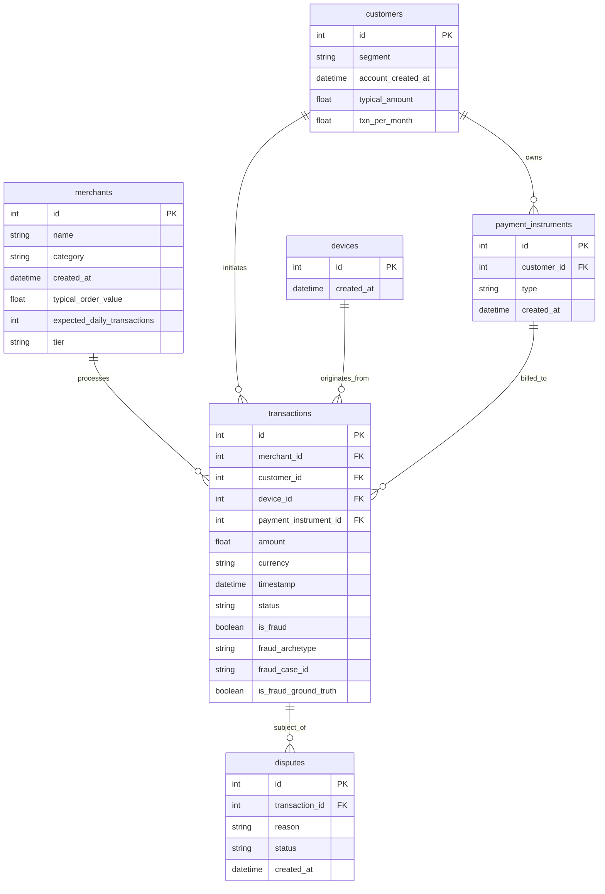

# SentinelRisk — Synthetic Data Generation

> Realistic, reproducible synthetic payments ecosystem for defensive risk modeling and evaluation.

---

## 1. Overview & Purpose

SentinelRisk utilizes a **deterministic, behavioral synthetic data generator** to simulate payment network activity over a 6-month period. 

### Why Synthetic Data?
1. **Safety & Privacy**: Real payment data contains strict PII (card PANs, names, bank details) that cannot and should not be stored or exposed in development environments.
2. **Ground Truth Certainty**: In real-world payment data, fraud labels are noisy, delayed by chargeback cycles (often 30–90 days), or missed entirely. Synthetic simulation provides **exact, known ground truth** for controlled model training and benchmark evaluations.
3. **Reproducibility**: Experiments, model comparisons, and graph analysis algorithms can be reproduced down to the exact transaction ID using fixed random seeds.

> [!IMPORTANT]
> **Disclaimer**: This dataset is completely synthetic and generated for development and defensive evaluation. It does not represent or contain proprietary Razorpay production data or real cardholder credentials.

---

## 2. Entity Architecture & Relational Model



---

## 3. Behavioral Generation Model

Rather than generating independent random rows, transaction generation is **agent-based and behaviorally driven**:

### Merchant Modeling (1,500 Merchants)
- **10 Business Categories**: Electronics, Fashion, Grocery, Food Delivery, Travel, Education, Digital Services, Health, Home, Entertainment.
- Category-specific Average Order Value (AOV), standard deviation, and daily volume distributions (e.g., Electronics has high AOV / low volume, Food Delivery has low AOV / high volume).
- **3 Merchant Tiers**: Small (50%), Medium (35%), Large (15%) with volume multipliers.

### Customer Behavioral Profiles (40,000 Customers)
- **4 Behavioral Segments**:
  - `low_frequency` (40%): ~1 transaction/month.
  - `regular` (35%): ~4 transactions/month.
  - `high_frequency` (15%): ~12 transactions/month.
  - `high_value` (10%): ~3 transactions/month at 3x typical basket size.
- **Preferences**: Preferred merchant categories, preferred hour of day (Gaussian distribution centered on customer peak hours), preferred days of week.
- **Amount Modeling**: Log-normal spending profiles with natural variations and occasional legitimate high-ticket purchases (1.5% probability of major purchases).

### Devices & Legitimate Sharing
- Most customers use 1–2 primary devices.
- **Legitimate Device Sharing**: ~2% of devices are legitimately shared across 2–3 family members, household members, or shared office PCs. This ensures models cannot rely on a naive rule like `shared_device == fraud`.

---

## 4. Fraud Archetypes & Ground Truth Injection

Three explicit fraud archetypes are injected into the dataset with tracked ground truth:

### Archetype 1: Account Takeover (ATO)
- **Scenario**: An established customer with previous clean transaction history is compromised.
- **Pattern**: An attacker's new device is introduced, followed by a sudden burst of 3–6 high-ticket transactions (3x normal amount) in rapid succession (often targeting electronics or travel).
- **Metadata**: `fraud_archetype = "account_takeover"`, `fraud_case_id = "ATO_XXX"`.

### Archetype 2: Card Testing / Velocity Fraud
- **Scenario**: Attackers testing stolen card credentials against low-friction digital merchants.
- **Pattern**: Rapid-fire burst of 12–18 small transactions (₹10–₹100) within minutes, with a high failure/decline rate (~45%).
- **Metadata**: `fraud_archetype = "card_testing"`, `fraud_case_id = "CT_XXX"`.

### Archetype 3: Coordinated Abuse Rings
- **Scenario**: Organized fraud syndicate operating multiple synthetic customer accounts.
- **Pattern**: 3 to 6 synthetic accounts sharing common devices and payment instruments, transacting in concentrated bursts across target merchant clusters.
- **Metadata**: `fraud_archetype = "coordinated_ring"`, `fraud_case_id = "RING_XXX"`.

---

## 5. Label Noise & Ground Truth Integrity

Real payment operations suffer from label noise (delayed reporting, friendly fraud, unconfirmed disputes). 

SentinelRisk implements a **2% label noise rate** on `is_fraud`, while strictly preserving the pristine synthetic truth in `is_fraud_ground_truth`:
- `is_fraud`: Noisy observed label representing what an operational team sees in production.
- `is_fraud_ground_truth`: Pristine target used strictly for final evaluation metrics and benchmark reporting.

---

## 6. Temporal Causality & Dispute Generation

- **Simulated Window**: 2025-01-01 to 2025-06-30 (6 months).
- **Strict Chronological Ordering**: Transactions are sorted strictly by timestamp.
- **Delayed Disputes**:
  - Disputes occur **3 to 45 days after** the transaction.
  - ~60% of fraudulent transactions result in chargebacks/disputes (`fraud_reported`, `unauthorized_transaction`).
  - ~0.8% of legitimate transactions result in commercial disputes (`product_not_received`, `billing_error`).
  - **No Data Leakage**: Future dispute outcomes are strictly timestamped after the transaction and cannot be accessed at decision time $T$.

---

## 7. Data Generation & Seeding Commands

### Generate Dataset
```bash
python scripts/generate_data.py --seed 42
```

### Validate Dataset Quality
```bash
python scripts/validate_data.py
```

### Seed SQLite Database
```bash
python scripts/seed_database.py
```
